# ARCHITECTURE_DIAGRAM.md
## DriftSystem 架构流程图（Mermaid Diagrams）

> **Research Task**: 使用 Mermaid 可视化"玩家 → 指令 → 路由 → 任务逻辑 → 执行器 → 世界变更"的完整路径

---

## 1. 系统总体架构（High-Level Architecture）

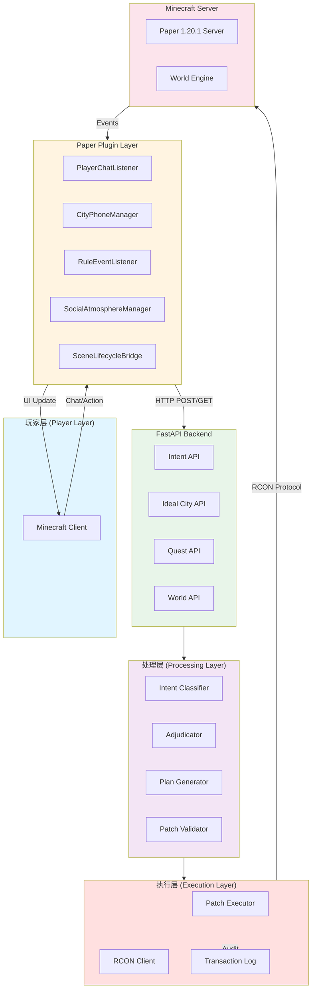

---

## 2. 玩家输入 → 世界变更完整流程

### 2.1 自然语言建造流程（Creation Workflow）

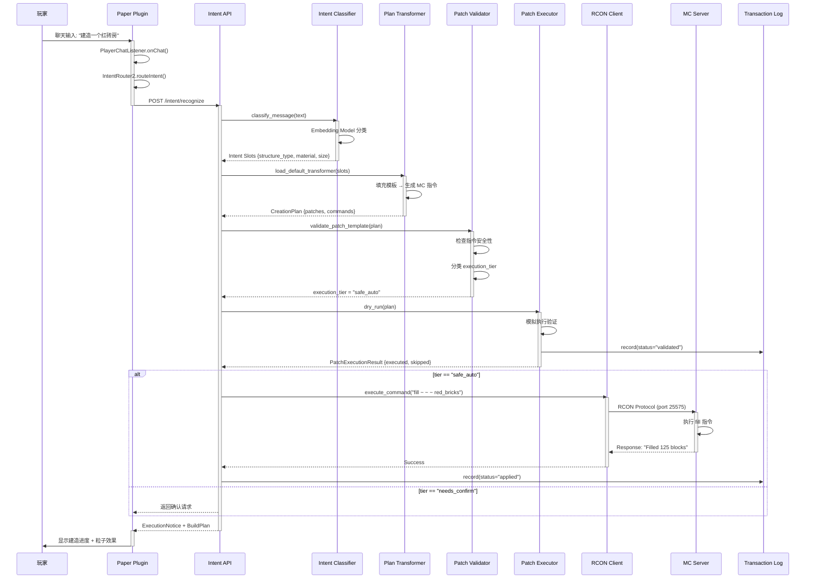

**通信协议标注**:
- Plugin → Backend: **HTTP/JSON** (REST API)
- Backend → MC Server: **RCON Protocol** (port 25575, TCP)
- MC Server → Plugin: **Bukkit Event System** (内存事件总线)

---

### 2.2 CityPhone 档案馆提交流程（Ideal City Pipeline）

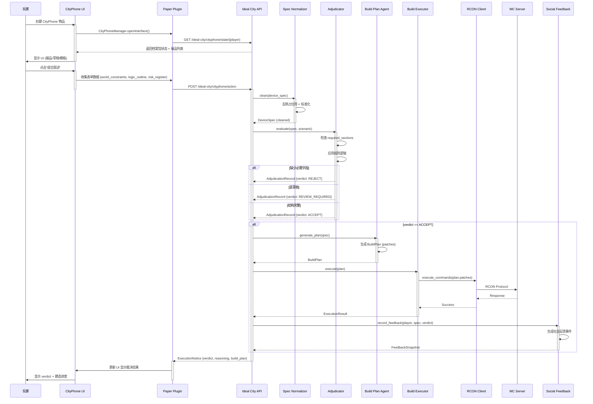

**通信协议标注**:
- Plugin → Backend: **HTTP/JSON** (REST API)
- Backend → MC Server: **RCON Protocol**
- Backend → File System: **JSON File I/O** (protocol/cityphone/social-feed/)

---

### 2.3 Quest/Task 验证流程（Quest Runtime）

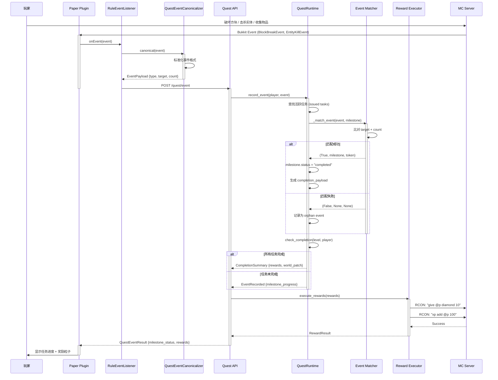

**通信协议标注**:
- Plugin → Backend: **HTTP/JSON**
- Backend → MC Server: **RCON Protocol**
- MC Server → Plugin: **Bukkit Event System**

---

## 3. 数据流架构图（Data Flow Architecture）

```mermaid
graph LR
    subgraph Input["输入层"]
        Chat[玩家聊天]
        CityPhoneUI[CityPhone UI]
        GameEvent[游戏事件]
    end
    
    subgraph Capture["捕获层"]
        ChatListener[Chat Listener]
        CPListener[CityPhone Listener]
        RuleListener[Rule Event Listener]
    end
    
    subgraph Router["路由层"]
        IntentRouter[Intent Router]
        IdealCityRouter[Ideal City Router]
        QuestRouter[Quest Router]
    end
    
    subgraph Processing["处理层"]
        IntentClassifier[Intent Classifier<br/>Embedding Model]
        Adjudicator[Adjudicator<br/>Rule-based Decision]
        QuestMatcher[Quest Matcher<br/>Event Matching]
    end
    
    subgraph Generation["生成层"]
        PlanGenerator[Plan Generator<br/>Template Filling]
        BuildPlanAgent[Build Plan Agent<br/>Patch Generation]
        RewardGenerator[Reward Generator<br/>Loot Table]
    end
    
    subgraph Validation["验证层"]
        CommandSafety[Command Safety<br/>Whitelist/Blacklist]
        TemplateValidator[Template Validator<br/>Structure Check]
        PatchExecutor[Patch Executor<br/>Dry-Run]
    end
    
    subgraph Execution["执行层"]
        RCONClient[RCON Client<br/>Command Dispatch]
        WorldEngine[World Engine<br/>MC Server]
    end
    
    subgraph Audit["审计层"]
        TransactionLog[Transaction Log<br/>Append-Only]
        SocialFeedback[Social Feedback<br/>Event Stream]
    end
    
    Chat --> ChatListener --> IntentRouter --> IntentClassifier
    CityPhoneUI --> CPListener --> IdealCityRouter --> Adjudicator
    GameEvent --> RuleListener --> QuestRouter --> QuestMatcher
    
    IntentClassifier --> PlanGenerator
    Adjudicator --> BuildPlanAgent
    QuestMatcher --> RewardGenerator
    
    PlanGenerator --> CommandSafety --> TemplateValidator --> PatchExecutor
    BuildPlanAgent --> TemplateValidator
    RewardGenerator --> RCONClient
    
    PatchExecutor --> RCONClient --> WorldEngine
    
    PatchExecutor --> TransactionLog
    Adjudicator --> SocialFeedback
    
    style Input fill:#e3f2fd
    style Capture fill:#f3e5f5
    style Router fill:#fff9c4
    style Processing fill:#c8e6c9
    style Generation fill:#ffccbc
    style Validation fill:#ffecb3
    style Execution fill:#f8bbd0
    style Audit fill:#d1c4e9
```

---

## 4. 验证门控流程图（Validation Gates Flow）

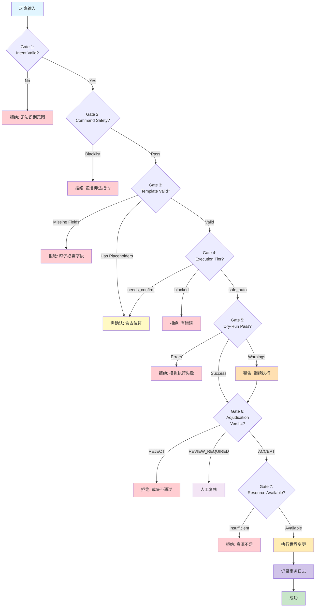

---

## 5. 系统分层架构（Layered Architecture）

```mermaid
graph TB
    subgraph Layer1["表现层 (Presentation Layer)"]
        UI1[Minecraft Client UI]
        UI2[CityPhone Interface]
        UI3[Chat Interface]
    end
    
    subgraph Layer2["插件层 (Plugin Layer)"]
        P1[Event Listeners]
        P2[UI Managers]
        P3[HTTP Client]
    end
    
    subgraph Layer3["API 层 (API Layer)"]
        API1[Intent API]
        API2[Ideal City API]
        API3[Quest API]
        API4[World API]
    end
    
    subgraph Layer4["服务层 (Service Layer)"]
        S1[Creation Workflow]
        S2[Ideal City Pipeline]
        S3[Quest Runtime]
        S4[Story Engine]
    end
    
    subgraph Layer5["核心层 (Core Layer)"]
        C1[Intent Classifier]
        C2[Adjudicator]
        C3[Plan Generator]
        C4[Patch Validator]
    end
    
    subgraph Layer6["执行层 (Execution Layer)"]
        E1[Patch Executor]
        E2[Build Executor]
        E3[RCON Client]
    end
    
    subgraph Layer7["持久层 (Persistence Layer)"]
        D1[Transaction Log]
        D2[Level Data]
        D3[Social Feedback]
        D4[Protocol Files]
    end
    
    subgraph Layer8["基础设施层 (Infrastructure Layer)"]
        I1[Minecraft Server]
        I2[World Engine]
        I3[Entity Manager]
    end
    
    Layer1 --> Layer2
    Layer2 --> Layer3
    Layer3 --> Layer4
    Layer4 --> Layer5
    Layer5 --> Layer6
    Layer6 --> Layer7
    Layer6 --> Layer8
    Layer7 --> Layer8
    
    style Layer1 fill:#e3f2fd
    style Layer2 fill:#f3e5f5
    style Layer3 fill:#fff9c4
    style Layer4 fill:#c8e6c9
    style Layer5 fill:#ffccbc
    style Layer6 fill:#ffecb3
    style Layer7 fill:#d1c4e9
    style Layer8 fill:#f8bbd0
```

---

## 6. 通信协议总览（Communication Protocols）

| 通信路径 | 协议 | 端口/方式 | 数据格式 | 示例 |
|----------|------|-----------|----------|------|
| **Player → Plugin** | Bukkit Event | 内存事件总线 | Java Objects | `PlayerChatEvent`, `PlayerMoveEvent` |
| **Plugin → Backend** | HTTP REST | 8000 | JSON | `POST /intent/recognize {"text": "建造房子"}` |
| **Backend → MC Server** | RCON | 25575 (TCP) | Plain Text | `fill 100 70 200 104 74 204 stone` |
| **MC Server → Plugin** | Bukkit Event | 内存事件总线 | Java Objects | `BlockBreakEvent`, `EntitySpawnEvent` |
| **Backend → File System** | File I/O | N/A | JSON/JSONL | `protocol/cityphone/social-feed/events.jsonl` |
| **Plugin → Player** | Bukkit API | 客户端 | Minecraft Packets | `player.sendTitle()`, `player.spawnParticle()` |

---

## 7. 关键路径时序图（Critical Path Timeline）

```mermaid
gantt
    title 玩家输入到世界变更的关键路径时间线
    dateFormat X
    axisFormat %L ms
    
    section 捕获层
    Chat Event Capture       :0, 5
    Intent Payload Build     :5, 10
    
    section 路由层
    HTTP Request Send        :10, 30
    API Route Dispatch       :30, 35
    
    section 处理层
    Intent Classification    :35, 150
    Plan Generation          :150, 250
    
    section 验证层
    Command Safety Check     :250, 270
    Template Validation      :270, 290
    Dry-Run Execution        :290, 320
    
    section 执行层
    RCON Connection          :320, 340
    Command Dispatch         :340, 360
    World Mutation           :360, 400
    
    section 审计层
    Transaction Log Write    :400, 420
    Response Build           :420, 450
    
    section 反馈层
    HTTP Response Send       :450, 480
    UI Update                :480, 500
```

**关键性能瓶颈**:
1. **Intent Classification** (115ms): Embedding model 推理
2. **Plan Generation** (100ms): 模板填充与指令生成
3. **World Mutation** (40ms): MC Server 执行方块放置

**总延迟**: ~500ms (从玩家输入到 UI 更新)

---

## 8. 错误处理流程图（Error Handling Flow）

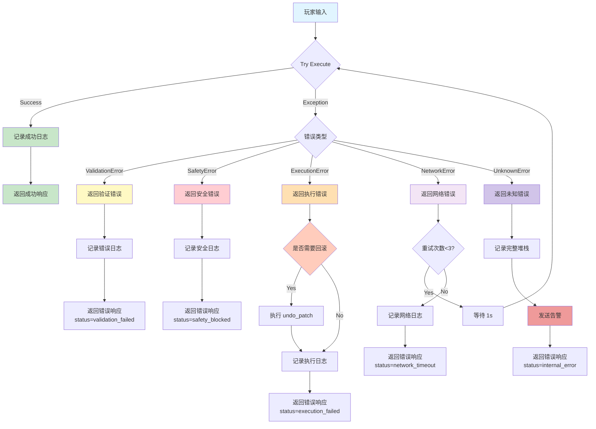

---

## 9. 状态机图（State Machine Diagram）

### 9.1 Patch 执行状态机

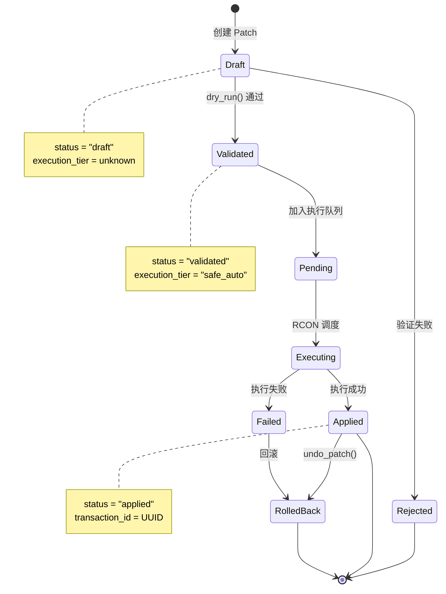

---

### 9.2 Quest 任务状态机

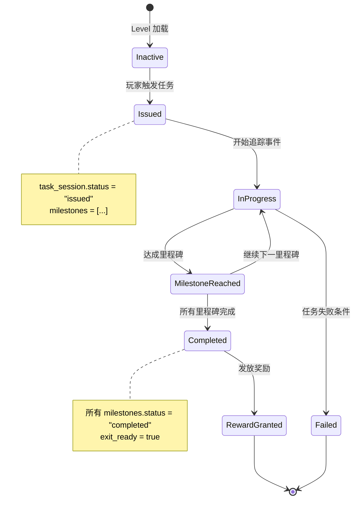

---

## 10. 部署架构图（Deployment Architecture）

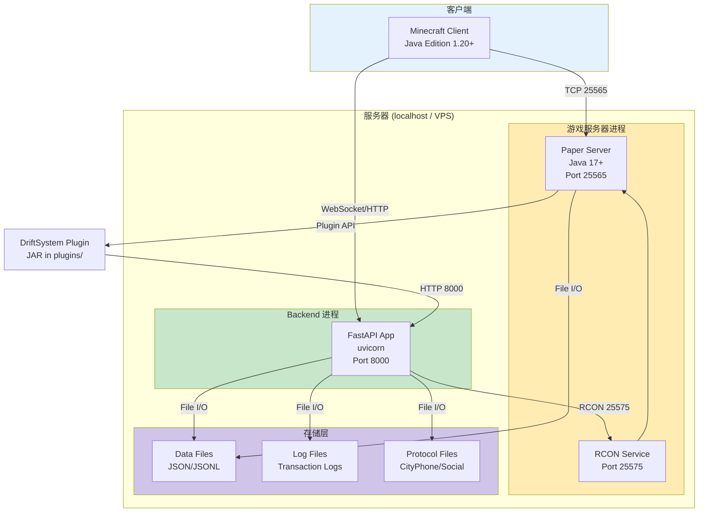

---

## 总结

### 关键发现
1. **三层通信模式**: Client ↔ Plugin ↔ Backend ↔ MC Server
2. **四种协议**: Bukkit Event, HTTP/JSON, RCON, File I/O
3. **七个验证门控**: Intent Valid → Command Safety → Template Valid → Execution Tier → Dry-Run → Adjudication → Resource Check
4. **九个处理层**: Capture → Route → Process → Generate → Validate → Execute → Audit → Feedback → Presentation

### 数学验证插入点
- **Gate 3** (Template Validation): 可添加数学公式验证
- **Gate 6** (Adjudication): 可要求数学证明作为 verdict 条件
- **Transaction Log**: 可存储证明轨迹 (proof payload)
- **Quest Matcher**: 可要求数学条件匹配 (mathematical predicate)

### 性能瓶颈
- **Intent Classification**: 115ms (可优化为本地模型)
- **RCON 通信**: 20-40ms (无法优化，协议限制)
- **文件 I/O**: 变量 (可缓存 + 异步写入)
